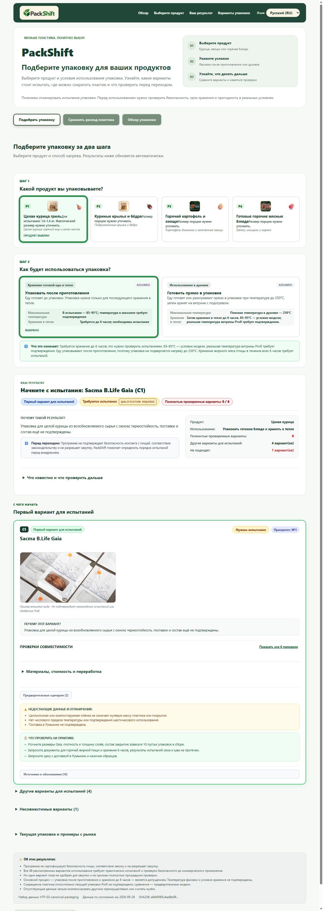

# PackShift (GigaFood) — Система подбора экологичной упаковки для пищевого ритейла

> 🏆 **Проект разработан на Хакатоне AgriFood 2026 (Profi Retail Challenge).**  
> 🤝 **Формат:** Командная работа (Team SoS — Slave of Skynet).  
> 🌍 **Постоянная онлайн-версия 24/7 (Live Demo):** [https://denis100strike.github.io/packshift/](https://denis100strike.github.io/packshift/)  
> 📁 **Репозиторий в моём профиле GitHub:** [https://github.com/denis100strike/Hackaton-202636](https://github.com/denis100strike/Hackaton-202636)  
> 🤝 **Общий командный репозиторий:** [https://github.com/Slave-of-Skynet/gigafood](https://github.com/Slave-of-Skynet/gigafood)  
> 🎯 **Цель:** автоматизация подбора упаковки для отдела горячей кулинарии (Rotisserie & Hot Food Counter), сокращение использования первичного пластика (Virgin Plastic) до 91% и валидация соответствия требованиям безопасности пищевых продуктов и термостойкости (до 250°C).



---

## 👥 Состав команды хакатона (Team SoS)

Проект является результатом слаженной командной работы междисциплинарной команды разработчиков и исследователей:

| Участник | Роль в проекте | Зона ответственности и ключевой вклад |
|---|---|---|
| **Денис Миронов** ([@denis100strike](https://github.com/denis100strike)) | **Frontend Developer & UI Integration** | Разработка и верстка интерактивных UI-компонентов на React 19/TypeScript, создание системы переключения языков (i18n), интерактивный SVG радар-пентагон, адаптивная верстка, клиентская интеграция с FastAPI. |
| **Вадим** ([@Mr-Ressentiment](https://github.com/Mr-Ressentiment)) | **Product Owner & Физическая концепция** | Автор инженерного ТЗ и спецификации **HTF-05** (термо-пакеты до 250°C, бесклеевая термокомпрессия aPET, модель парового охлаждения steam cooling, продуктовые архетипы P1–P4). |
| **Игорь Гладышев** ([@Igor](https://github.com/igor-gladyshev)) | **Packaging Research & Data Recon** | Анализ рынка европейских производителей упаковки (Sirane, Ready Chef Go, Faerch, Contital), сбор и проверка доказательной базы (Tiers A/B), сертификаты контакта с пищей. |
| **Алиса Анусат** ([@lisqrn](https://github.com/lisqrn)) | **Frontend Development & Data Modeling** | Моделирование структур данных для интерфейса, визуализация состояний гейтов, проектирование карточек кандидатов и сопоставлений. |
| **Владимир Барбалат** ([@barbalatv](https://github.com/barbalatv)) | **Backend Development & Domain Engine** | Архитектура и реализация расчётного движка на Python/FastAPI, матрица 6 Hard Gates, fail-closed валидация данных, покрытие 165 автоматическими тестами (100% PASS). |

---

## 📌 Ключевые возможности проекта

1. **Инженерная разработка термо-упаковки (Grill & Oven Pouch до 250°C — HTF-05):**
   - Разработка двух универсальных физических решений: **Гибкий фольгированный пакет (Foil Grill & Oven Bag)** и **Алюминиевый лоток + силиконовая крышка LSR (Ready to Bake Combo)**.
   - **Физика 250°C:** Паровое охлаждение за счёт фазового перехода влаги продукта удерживает температуру плёнки ≤110–130°C (усадка всего 2–5%, 100% сохранение прозрачности и безопасности контакта).
   - **Шов без клея:** Термокомпрессионная сварка aPET в микропоры алюминия (механический замок, полное исключение токсичных клеев).
   - **Фактор Румынии:** Лёгкое ручное разделение Easy-Peel без инструментов для раздельного сбора отходов (алюминий — в металл, ПЭТ — в пластик).

2. **Интерактивный радар-пентагон с изоляцией серий:**
   - Сравнение ключевых характеристик нашего решения против худшей альтернативы (стандартный PP-бокс 32г).
   - Интерактивная изоляция графиков при наведении курсора или клике на кнопки фильтров (`[⚖️ Оба]`, `[🟢 Только наше решение]`, `[🔴 Только худшая альтернатива]`).

3. **Двухэтапный подбор упаковки (Recommendation Journey):**
   - Выбор пищевого архетипа: целая курица гриль (P1), крылья/бёдра (P2), картофель и овощи (P3), горячие мясные блюда (P4).
   - Выбор температурного и технологического сценария: фасовка после приготовления (hot-hold до 6 часов при 85–95°C) или запекание/разогрев в упаковке (до 250°C).

4. **Строгая матрица совместимости (6 Hard Gates):**
   - Автоматическая проверка 6 критических барьеров: геометрия и вместимость, термостойкость материала, жиростойкость, целостность шва/замка, безопасность контакта с пищей (BOM), доступность цепочки поставок в регионе (Румыния / ЕС).

5. **Расчёт экологических и материальных метрик:**
   - Масса упаковки, масса полимеров, доля первичного пластика.
   - Процент и граммы сокращения первичного пластика относительно текущей базовой упаковки (сокращение до 91%).
   - Оценка экономической целесообразности и стоимости за единицу в леях (RON).

6. **Полная мультиязычность в 1 клик (i18n):**
   - Мгновенное переключение языков интерфейса: **`[🇷🇺 RU]` Русский**, **`[🇲🇩 RO / MD]` Română / Moldovenească**, **`[🇬🇧 EN]` English**.
   - Более 4 200 переведенных канонических строк, включая дисклеймеры и технические спецификации.

7. **Симуляция паспорта соответствия EU / FDA:**
   - Модальное окно паспорта соответствия техническим регламентам с возможностью печати и экспорта в PDF в 1 клик.

8. **Надёжная инженерная архитектура (Zero-Failure UI):**
   - Встроенный офлайн-кэш: приложение мгновенно открывается и работает даже без подключения к сети и на статическом хостинге GitHub Pages.
   - 165 автоматических тестов бэкенда (`pytest`) с проверкой математики расчётов и контрактов API.

---

## 🛠 Технологический стек

- **Frontend:** React 19, TypeScript, Vite, CSS3 (модульный адаптивный дизайн, SVG-графики).
- **Backend:** Python 3.11+, FastAPI, Pydantic v2, Uvicorn.
- **Тестирование и валидация:** Pytest, AnyIO, Starlette TestClient.
- **Данные:** Каноническая база доказательств в JSON (публичные спецификации поставщиков Sacma, Biopap, Faerch, Sirane и др.).
- **Облачный деплой:** GitHub Pages (`https://denis100strike.github.io/packshift/`).

---

## 📂 Структура папок

```text
PackShift_Agrifood_Portfolio/
├── frontend/             # Исходный код клиентской части (React 19, TS, Vite)
│   ├── src/              # Компоненты React, хуки, мультиязычность (i18n)
│   ├── public/           # Графика, логотипы, фото упаковок и блюд
│   ├── dist/             # Собранная production-версия интерфейса
│   ├── package.json      # Зависимости интерфейса
│   └── vite.config.ts    # Конфигурация сборщика Vite
├── backend/              # Серверная часть и расчётный движок
│   ├── app/              # FastAPI приложение, модели Pydantic, логика расчётов
│   ├── tests/            # Набор из 165 автоматических тестов
│   └── pyproject.toml    # Конфигурация Python пакета
├── data/                 # Канонические датасеты доказательной базы упаковки
├── docs/                 # Документация и технические отчёты
├── scripts/              # Скрипты запуска, проверки и предстартовой валидации
├── preview.png           # Скриншот работающего интерфейса
├── ЗАПУСК.bat            # Умный файл запуска в 1 клик для Windows
└── О_ПРОЕКТЕ_PORTFOLIO.md# Описание проекта и команды для портфолио
```

---

## 🚀 Как запустить проект локально

### Вариант 1 (В 1 клик для Windows):
Просто дважды кликните по файлу **`ЗАПУСК.bat`** в папке проекта. Он проверит, запущен ли уже сервер, при необходимости запустит его и откроет проект в браузере по адресу `http://127.0.0.1:5173`.

### Вариант 2 (Через терминал):
1. **Установка зависимостей:**
   ```bash
   pip install -e backend
   cd frontend && npm install && cd ..
   ```
2. **Запуск:**
   ```bash
   python scripts/demo.py
   ```
3. Откройте в браузере: `http://127.0.0.1:5173`.
